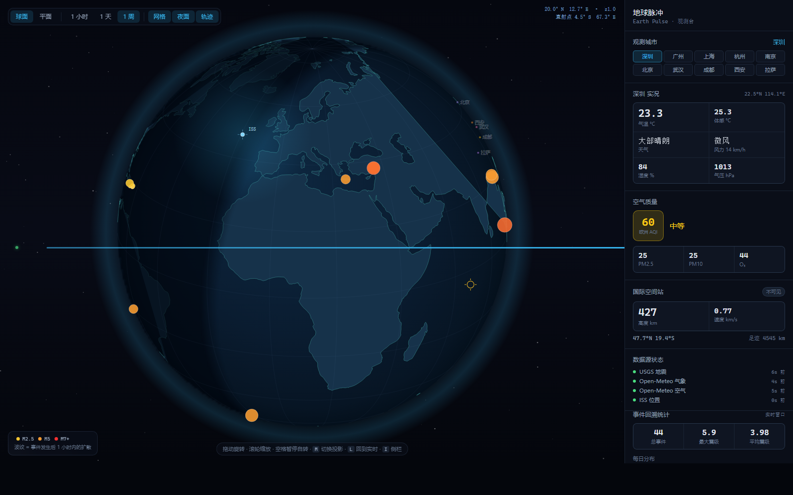
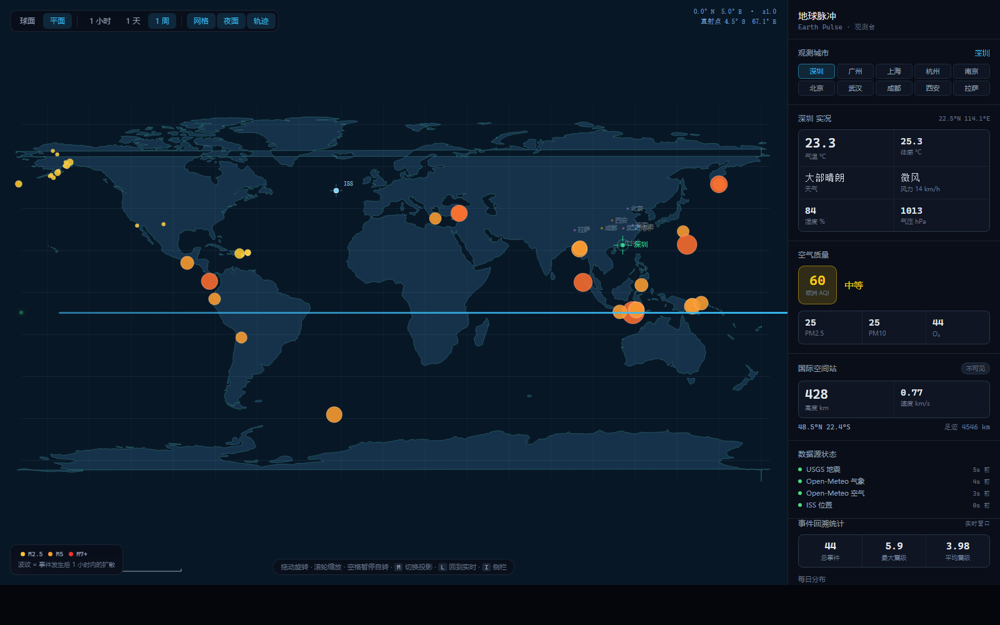

# 地球脉冲 Earth Pulse

> 把全球真实观测数据画在地球上的可视化工具。
> **零 API Key · 零服务端 · 零第三方图形库 · 零构建步骤**


一个能跑起来的实时观测台：全球地震在地球上泛起波纹，国际空间站的地面足迹
缓缓扫过，晨昏线随真实太阳位置移动，侧栏是你选的城市的实时气象。

**克隆下来，一条命令就能跑** —— 不需要注册、不需要配置、不需要付费密钥。



<details>
<summary>平面投影（等距圆柱）—— 看全球事件分布更直观</summary>



</details>

---

## 目录

- [这是什么](#这是什么)
- [快速开始](#快速开始)
- [核心功能](#核心功能)
- [观测城市](#观测城市)
- [可选：AI 解读](#可选ai-解读)
- [交互速查](#交互速查)
- [数据源](#数据源)
- [测试](#测试)
- [架构](#架构)
- [设计决策](#设计决策)
- [FAQ](#faq)
- [许可](#许可)
- [数据归属](#数据归属)

---

## 这是什么

四类真实数据，实时绘制在自绘的地球上：

| 数据 | 内容 | 更新频率 |
|---|---|---|
| **地震** | 全球 M2.5+ 实时地震：位置、震级、深度、海啸标记 | 4 分钟 |
| **空间站** | 国际空间站实时位置、轨道高度、地面足迹、运行轨迹 | 2 秒 |
| **气象** | 10 座城市的温度、体感、天气、风力、湿度、气压 | 10 分钟 |
| **空气质量** | PM2.5 / PM10 / O₃ 与欧洲 AQI 等级 | 15 分钟 |

所有数据来自公开接口，**浏览器直接请求**。
没有后端，没有代理，没有 API Key，没有构建步骤。

## 快速开始

```bash
git clone https://github.com/Xiwangsou/earth-pulse.git
cd earth-pulse
node scripts/serve.mjs
```

打开 <http://127.0.0.1:8848> 即可。

要求 Node.js 18+（仅用于起静态服务器，项目本身零依赖）。
用任何其他静态服务器也行：

```bash
python -m http.server 8848
npx serve .
```

> **为什么不能双击 index.html？**
> `file://` 协议下浏览器会拒绝加载 ES 模块（跨源安全策略）。
> 这是浏览器的安全限制，不是项目问题，必须通过 http 打开。
>
> 部署到线上同理 —— 任何静态托管（GitHub Pages / Vercel / Netlify）都能直接跑，
> 不需要服务端运行环境。

## 核心功能

### 1. 球面 / 平面双投影

按 `M` 或点工具栏切换。

- **球面（正射投影）** —— 模拟从无穷远观察地球，有真实的背面剔除：
  转到地球背面时，那里的地图和事件会正确地消失。
- **平面（等距圆柱投影）** —— 全球无变形，适合看事件的空间分布。

两套投影数学都是手写的，见 `src/core/projection.js`。

### 2. 时间轴回溯

**这是本项目区别于同类工具的核心设计。**

同类实时看板的数据是单向流：看一眼就没了。本项目把时间变成一根可拖动的轴：

- 拖动时间条，地图重放任意时刻的事件分布
- 地震波纹会**重新扩散一遍** —— 因为波纹状态是按「回溯时刻 − 事件发生时刻」
  实时算出来的，不是录制下来的视频帧
- 回溯时只能看到**该时刻已经发生**的事件，未来事件不会泄漏
- 随时点 `L` 或点 LIVE 回到实时

按 `→` `←` 可以逐帧步进。

### 3. 事件统计

随时间轴联动，实时重算：

- 事件总数、最大震级、平均震级
- 每日事件分布（柱状图）
- 高发区域 Top 6

## 观测城市

侧栏顶部可切换 10 座城市，覆盖 7 个地理区：

| 区域 | 城市 |
|---|---|
| 华南 | 深圳（默认）、广州 |
| 华东 | 上海、杭州、南京 |
| 华北 | 北京 |
| 华中 | 武汉 |
| 西南 | 成都 |
| 西北 | 西安 |
| 高原 | 拉萨 |

选择这些城市不只是为了凑数量 —— 它们的气候与海拔差异足够大，
切换时能直观看到数据真的在变：

- **拉萨** 海拔 3650m，气压约 665 hPa；**上海** 海拔 4m，气压约 1018 hPa
- 冬季的北方城市与全年湿热的华南城市，温度曲线完全不同

测试里专门加了一条断言校验**气压与海拔的负相关**——
如果哪个城市的坐标写错了，这项会立刻暴露。

地图上会同时标出全部 10 座城市，当前选中的用十字丝高亮。

## 可选：AI 解读

侧栏底部可以接入大模型，对当前统计生成一段研判。

**默认关闭。不配置任何 Key，应用的其余功能 100% 可用。**

支持通义千问（DashScope）、OpenAI、Anthropic 三家。

隐私设计：

- Key 只存在浏览器 `localStorage`，不上传任何服务器
- **只在你主动点击「生成解读」时才发起请求**
- 发送内容经过裁剪：只有汇总后的统计数字，**不含精确经纬度、不含你的观测站位置**
- 点「查看发送内容」可以看到将要发出去的完整 JSON，自己核对

## 数据源

全部为公开接口，浏览器可直连（已实测 CORS 头为 `*`）。

| 用途 | 来源 | 许可 | 更新频率 |
|---|---|---|---|
| 地震 | USGS 地震目录 | 美国公有领域 | 4 分钟 |
| 气象 | Open-Meteo | CC BY 4.0 | 10 分钟 |
| 空气质量 | Open-Meteo | CC BY 4.0 | 15 分钟 |
| 空间站 | wheretheiss.at | 公开接口 | 2 秒 |
| 海岸线 | Natural Earth 110m Land | 公有领域 | 静态 |

**已排除：OpenSky Network** —— 实测其 `Access-Control-Allow-Origin` 仅允许
`https://opensky-network.org`，浏览器直连必然失败，因此不纳入本项目。

## 交互速查

| 操作 | 作用 |
|---|---|
| 拖动 | 旋转地球 |
| 滚轮 | 缩放 |
| 点击事件点 | 锁定该地震的详细信息 |
| `↑` `↓` | 纬度旋转（`Shift` 加速） |
| `←` `→` | 经度旋转 / 时间轴步进（Shift 加速） |
| `空格` | 暂停 / 恢复自转 |
| `M` | 切换球面 / 平面投影 |
| `G` | 经纬网格 |
| `N` | 晨昏线与夜面 |
| `R` | 切换自转 |
| `L` | 回到实时 |
| `I` | 侧栏 |
| `Home` `End` | 时间轴跳到最早 / 最新 |

时间轴获得焦点后，`←` `→` 为逐步回溯，`Home` / `End` 为跳到两端。

## 架构

```
earth-pulse/
├── index.html
├── src/
│   ├── main.js              入口：装配与轮询调度
│   ├── core/
│   │   ├── projection.js    球面投影 + 晨昏线（手写数学）
│   │   ├── renderer.js      Canvas 2D 渲染器
│   │   ├── timeline.js      时间轴回溯引擎
│   │   └── math.js          数值工具
│   ├── sources/
│   │   └── fetcher.js       数据获取：超时/重试/缓存/降级
│   ├── ui/
│   │   ├── sites.js         观测城市配置
│   │   ├── timeline-ui.js   时间轴控件 + 统计面板
│   │   ├── panels.js        侧栏数据面板
│   │   └── ai-brief.js      可选 AI 解读
│   └── styles.css
├── data/
│   └── land.js              陆地轮廓（由脚本生成，勿手改）
└── scripts/
    ├── serve.mjs            零依赖静态服务器
    ├── build-land.mjs       陆地数据预处理
    ├── verify.mjs           逻辑自检（50 项）
    ├── derive-inverse.mjs   逆变换推导验证（22万点数值验证）
    ├── render-regress.mjs   渲染层回归（22 项）
    ├── e2e-ui.mjs           交互与状态流转（46 项）
    ├── stress.mjs           压力与边界（47 项）
    ├── e2e-data.mjs         数据层端到端（73 项）
    └── shoot.mjs            CDP 截图工具
```

## 测试

共 **238 项**，分五套：

```bash
npm test              # 全跑
npm run verify       # 逻辑 50 项：投影正/逆变换、晨昏线、时间轴语义
npm run render       # 渲染 22 项：跨经线多边形、明暗连续性、帧预算
npm run e2e:ui       # 交互 46 项：站点切换、面板渲染、状态流转
npm run stress       # 压力 47 项：畸形输入、大数据量、长期运行内存
npm run e2e          # 数据 73 项：真实请求 10 座城市 × 2 个接口
npm run build:land   # 重新生成陆地数据
npm run shot         # 用无头浏览器给自己截图
```

这些测试的重点，最初发现了几个错误：

- **投影逆变换往返**：22 万点验证 `project → unproject` 误差在 1e-12 度内。
  逆变换错了，晨昏线会整体偏移，但看起来"挺像那么回事"，肉眼极难发现
- **跨 180° 经线的多边形**：俄罗斯这类跨越日期变更线的国家在球面上被切成两半，
  若不做子路径断开，会画出横穿画面的斜线
- **明暗连续性**：沿纬线扫描一圈，明暗交界必须恰好 2 次。
  采样点画法在春分/秋分（赤纬≈0）会产生大量碎片化切换
- **帧预算**：低分辨率离屏 + 限频后，晨昏线摊销到每帧必须 < 1ms
- **物理一致性**：气压必须随海拔升高而降低（坐标写错会立刻暴露）
- **压力边界**：`NaN` / `null` / `Infinity` / 字符串喂进投影会不会崩
- **长期运行**：模拟 24 小时与 10 倍时长，确认环形缓冲不漏、内存不涨
- **物理一致性**：气压必须随海拔升高而降低（坐标写错会立刻暴露）

### 关键设计决策

**为什么不用 Cesium 或 D3？**

复刻目标刻意不引入 3D 引擎。理由：Cesium 加载 1.1 MB 且硬依赖 WebGL，
而本项目要的只是「正对着观察者的球面」这一个视觉效果。
自己实现投影只用约 200 行，换来的是零依赖、精确的背面剔除控制权。

**为什么渲染器不直接持有数据？**

渲染器只认识 `Timeline` 给的快照，不认识任何数据源。
回溯时改变的是「读哪一份数据」，而不是系统状态 ——
所以不需要暂停网络请求、不需要重建渲染器，回溯才能做得干净。

**为什么快照不落盘？**

这是个观测工具，不是档案库。持久化的历史会让人误以为是权威存档。
需要权威历史请查数据源本身。时间轴只活在本次会话里。

**为什么手写陆地图而不切片？**

在线瓦片意味着外部依赖（Google / Esri / OSM 瓦片服务），
密钥或服务条款问题会立刻回来。自然地球数据是公有领域，
预处理成 85 KB 的本地 JS 模块，一次下载永久可用。

### 三个值得记录的技术坑

这三个 bug 靠盯屏幕很难发现，最终是靠截图和断言抓出来的。

**1. 跨 180° 经线的多边形会画出横穿画面的斜线**

俄罗斯、斐济这类跨越国际日期变更线的国家，在 GeoJSON 里是连续多边形，
但在球面上被切成两半。若代码在不可见处简单地继续 `lineTo`，
浏览器就会画出一条横穿整个画面的斜线。

正确做法：**不可见处抬笔**（`moveTo` 到画外），重新进入可见区时再落笔续上。
被遮住的部分本来就不该看见，拆成多个可见片段才是对的。
同样的处理也必须用在网格线和卫星轨迹上——它们都是折线。

**2. 网上常见的正射逆变换公式是错的**

晨昏线要逐像素判定"这个像素是否被太阳照到"，必须做逆变换（屏幕 → 经纬度）。
网上常见的「`c = acos(ρ)`，然后 `lat = asin(cos(c)·sin(φ₀) + y·sin(c)·cos(φ₀)/ρ)`」
实测误差达 90°~180°——那个公式的前提不成立。

本项目用代数法重新推导：由正向公式消去得到一元二次方程
`s² − 2·cosφ₀·y·s + (y² + sin²φ₀·x² − sin²φ₀) = 0`，取使 `z > 0` 的根。
22 万点验证最大误差 8.3e-12°（浮点精度极限）。
推导与验证脚本见 `scripts/derive-inverse.mjs`，可独立运行复现。

其中一个隐蔽陷阱：**可见性判定必须放在极点特判之前**。
二次方程的第一个候选根可能恰好是极点（`cosφ → 0`），
若先做极点特判就会误判为可见并提前返回，永远等不到真正的解。

**3. 逐像素渲染的性能陷阱**

晨昏线最初用"沿边界采样 360 个点画擦除圆"实现，
但晨昏线纬度 = `atan(−cos(h)/tan(δ))`，当太阳赤纬 δ→0（春分/秋分前后）
时 `tan(δ) → 0`，`atan` 趋于 ±90°，采样点被投影到地球边缘之外，
在球面边界留下扇贝状缺口。

改成逐像素判定后条纹消失，但实测 1600×1000 下需要 55 万次逆变换，
**单帧 53ms，占 60fps 预算的 320%** —— 页面直接卡死。

最终方案是**低分辨率离屏 + 限频**：
离屏画布按 1/4 边长渲染（像素数降到 1/16），重算频率上限 12fps。
晨昏线是 6° 宽的柔和渐变带，低分辨率放大后视觉上几乎无差别
（但经纬网格不能这样处理，细线低分辨率会明显锯齿）。
实测摊销到每帧 0.23ms，占帧预算 1.4%。

顺带一提：离屏缓存一开始按视点做key，但地球自转每帧都改视点，
缓存每帧失效等于没缓存——限频是必需的，不是优化。

## FAQ

**Q: 需要注册或申请 API Key 吗？**
不需要。四个数据源都是公开免key 接口，浏览器直连。
唯一可选的 AI 解读需要你自己的 key，但不配置应用功能完整。

**Q: 手机能看吗？**
能。窄屏下侧栏收起为抽屉，点击唤出。点按城市、拖动地球、
点击时间轴都支持触摸操作。

**Q: 时间轴能回溯多久？**
取决于本次会话的运行时长。快照每分钟一个，最多保留 12 小时；
地震事件保留最近 3000 条。刷新页面即清空（这是有意为之，见设计决策）。

**Q: 为什么没有航班数据？**
OpenSky Network 实测其 `Access-Control-Allow-Origin` 仅允许自家域名，
浏览器直连必然失败，除非自建代理服务器 —— 那样就违背了"零服务端"的前提。
宁可少一类数据，也不引入需要维护的后端。

**Q: 数据准吗？**
位置和事件本身来自权威源（USGS、各国航天机构），精度没问题。
但要注意：这是**观测工具不是预报工具**，不要用它做决策依据。
地震目录有几十秒到几分钟的延迟，气象是网格插值而非站点实测。

**Q: 断网了会怎样？**
已加载的数据继续显示，各数据源状态会标记为「缓存 N 分钟」或「失败」，
单个源失败不影响其他源渲染。恢复网络后下次轮询自动恢复。

**Q: 能改成自己的观测站吗？**
可以。编辑 `src/ui/sites.js`，加一行城市配置即可，
侧栏、地图标记、测试会自动跟上（坐标记得落在合理区域内）。

**Q: 商用没问题吗？**
代码 MIT 可商用。但**数据源各有条款**，商用前请自行确认：
USGS 与 Natural Earth 属公有领域，Open-Meteo 是 CC BY 4.0（需保留署名），
wheretheiss.at 为公开接口。

## 开发

```bash
npm test           # 全跑（238 项）
npm run verify     # 仅逻辑自检 50 项（含逆变换往返一致性）
npm run e2e:ui     # 仅交互验证 46 项
npm run stress     # 仅压力边界 47 项
npm run e2e        # 仅数据层 73 项（真实请求公开接口）
npm run build:land # 重新生成陆地数据
```

## 许可

代码 [MIT](LICENSE) © Xiwangsou

**代码与数据是两套许可** —— 运行时展示的数据来自第三方公开接口，
版权归各自所有者所有，完整归属要求见 [DATA_LICENSES.md](DATA_LICENSES.md)。

摘要：

- Natural Earth、USGS — 公有领域
- Open-Meteo — CC BY 4.0，**必须保留署名与链接**
- ISS 位置 — wheretheiss.at 公开接口

本项目仅为这些公开数据的可视化呈现，不对数据准确性、
完整性或及时性作任何担保。

## 数据归属

完整的数据归属、许可要求与免责声明见 [DATA_LICENSES.md](DATA_LICENSES.md)。

如果你 fork 本项目并对外提供服务，请自行确认所用数据源的服务条款
是否允许你的具体使用方式（尤其是否允许商业用途）。
